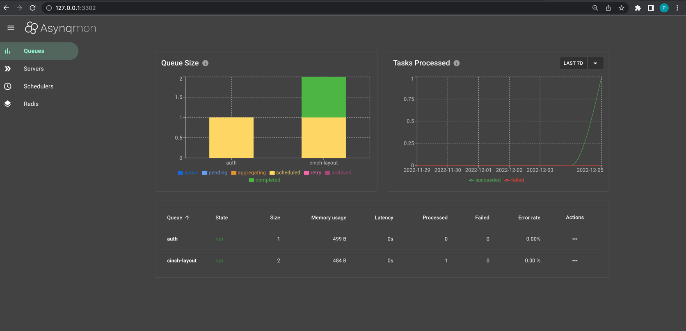

# 分布式异步任务


内置分布式异步(定时)任务, 基于[asynq](https://github.com/hibiken/asynq), 在业务场景中经常使用到


## Cron


周期任务, 执行多次, 一般项目初始化就注册完成

```go
    if len(c.Tasks) > 0 {
        for _, item := range c.Tasks {
            err = tk.worker.Cron(
                worker.WithRunGroup(item.Category),
                worker.WithRunUuid(item.Uuid),
                worker.WithRunExpr(item.Expr),
                worker.WithRunTimeout(int(item.Timeout)),
                worker.WithRunMaxRetry(int(item.Retry)),
            )
            if err != nil {
                err = errors.WithMessage(err, "initialize worker failed")
                return
            }
        }
    }
```

- `WithRunUuid` - 唯一id
- `WithRunGroup` - 分组名称, 便于查看
- `WithRunTimeout` - 超时时间
- `WithRunExpr` - Cron表达式, 最小单位1分钟, 参见[gorhill/cronexpr](https://github.com/gorhill/cronexpr)
- `WithRunMaxRetry` - 最大重试次数, 任务回调发生error会重试


?> 参见[layout.task.NewTask](https://github.com/go-cinch/layout/blob/dev/internal/pkg/task/task.go#L59)


## Once


单次任务, 执行一次, 执行完自动销毁, 一般在`internal/service`动态添加

```go
    s.task.Once(
        worker.WithRunCtx(ctx),
        worker.WithRunUuid(fmt.Sprintf("login.failed.%s", req.Username)),
        worker.WithRunGroup("login.failed"),
        worker.WithRunNow(true),
        worker.WithRunTimeout(10),
        worker.WithRunReplace(true),
        worker.WithRunPayload(utils.Struct2Json(biz.LoginTime{
            Username: req.Username,
            LastLogin: carbon.DateTime{
                Carbon: carbon.Now(),
            },
            Wrong: res.Wrong,
        })),
    )
```

- `WithRunUuid` - 唯一id
- `WithRunGroup` - 分组名称, 便于查看
- `WithRunNow` - 是否立即运行
- `WithRunTimeout` - 超时时间
- `WithRunReplace` - 是否替换同一个uuid任务, 若存在的话
- `WithRunPayload` - 载荷, 任务回调会使用到

?> 参见[auth.service.Login](https://github.com/go-cinch/auth/blob/dev/internal/service/auth.go#L61)


## 任务回调


任务回调一般定义在`internal/pkg/task/task.go`

```go
func process(t task) (err error) {
	tr := otel.Tracer("task")
	ctx, span := tr.Start(t.ctx, "Task")
	defer span.End()
	switch t.payload.Group {
	case "login.failed":
		var req biz.LoginTime
		utils.Json2Struct(&req, t.payload.Payload)
		err = t.user.WrongPwd(ctx, req)
	case "login.last":
		var req biz.LoginTime
		utils.Json2Struct(&req, t.payload.Payload)
		err = t.user.LastLogin(ctx, req.Username)
	}
	return
}
```

?> t.payload.Payload, 就是`WithRunPayload`携带值, 参见[layout.task.process](https://github.com/go-cinch/auth/blob/dev/internal/pkg/task/task.go#L72)  
完整源码[common/worker](https://github.com/go-cinch/common/blob/master/worker/worker.go)


## UI界面


为了方便查看任务执行情况, 你可以配置下[asynqmon](https://github.com/hibiken/asynqmon), 下面用[docker-compose](https://docs.docker.com/compose)简单演示下

```bash
vim docker-compose.yml
```

写入以下内容
```yaml
version: "3"

services:
  asynqmon:
    image: hibiken/asynqmon:master
    ports:
      - '3302:8080'
    command:
      - --redis-url=redis://192.168.5.105:6379/0
    deploy:
      resources:
        limits:
          cpus: '0.50'
          memory: '1024M'
```

!> 记得将redis-url改成你本地局域网地址

```bash
docker-compose --compatibility up -d
```

访问[http://127.0.0.1:3302](http://127.0.0.1:3302), 可以看到


