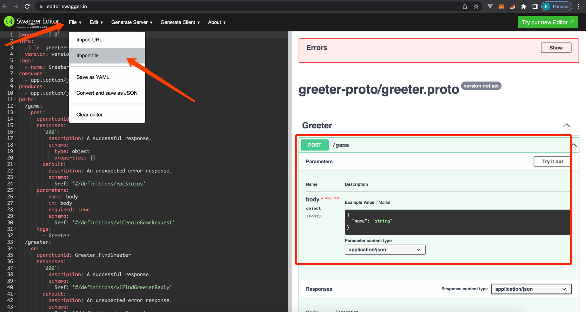

# 接口文档


当你完成第1-n个接口后, 需要给前端写文档, 这是传统的做法有2种
- 手撸一套接口文档
- 在各个接口前按照规定的注释规范写下一连串的注释, 通过工具生成html/json文件

但, Kratos给我们内置了swagger接口文档自动生成, 前提是你的proto文件按照规范编写, 下面看步骤


## 编译

执行编译api命令: 
```bash
cd game
make api
# 输出如下
# mkdir -p docs
# for NAME in api/reason-proto/reason.proto api/auth-proto/auth.proto api/greeter-proto/greeter.proto; do \
#                 ROOT=~/game; \
#                 DIR=`echo $NAME | awk -F '-proto/[^/]*$' '{print $1}'`; \
#                 echo $NAME; \
#                 protoc --proto_path=./api \
#                 --proto_path=./third_party \
#                 --go_out=. \
#                 --go-errors_out=. \
#                 --go-http_out=. \
#                 --go-grpc_out=. \
#                 --validate_out=lang=go:. \
#                 --openapiv2_out docs \
#                 --openapiv2_opt logtostderr=true \
#                 --openapiv2_opt json_names_for_fields=false \
#                 $NAME; \
#         done
# api/reason-proto/reason.proto
# api/auth-proto/auth.proto
# api/greeter-proto/greeter.proto
# You can import *.json into https://editor.swagger.io/
```

项目路径下会生成一个docs目录


## 在线预览
  

- 打开https://editor.swagger.io
- File => Import file
- 勾选docs/greeter-proto/greeter.swagger.json

- 接下来就可以把json文件丢给对接的同学, 直接在线看, 方便至极

!> 为什么不在项目内部开一个端口预览文档? 增加复杂性, 更新接口还要提交到代码中, 你应该多花时间专注业务~
